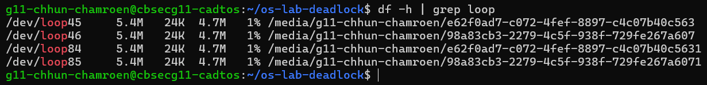
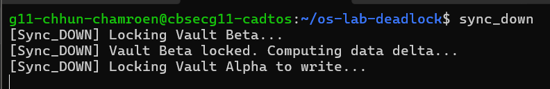
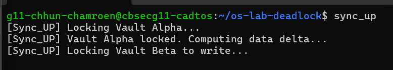
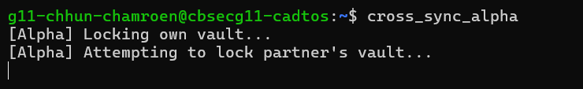
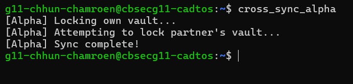
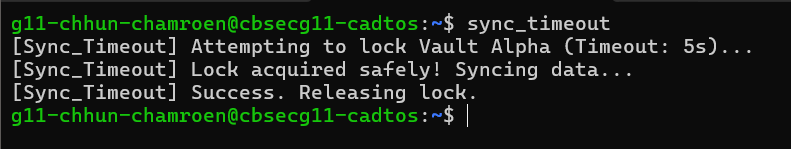
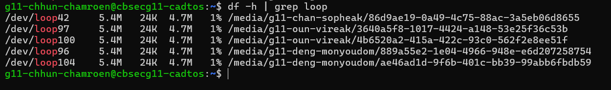

# OS Lab Deadlock Observations

## Level 1

**Observation:**  
This output shows that the virtual image files are successfully attached as loop devices 
and mounted into the filesystem. It proves that the system recognizes them as real storage devices.

-------------------------

## Level 3

**Observation 3:**  
The scripts froze because a classic circular wait occurred:  
- `sync_up` acquired the Vault Alpha lock first, then attempted to lock Vault Beta.  
- Simultaneously, `sync_down` acquired the Vault Beta lock first, then tried to lock Vault Alpha.  
- Both processes were now waiting for the resource the other held, creating a deadlock.

----------------------------

## Level 4

**Observation:**  
The scripts freeze because each process holds its own vault lock 
while waiting for the other’s lock, creating a circular wait. 
This demonstrates a distributed deadlock where neither process 
can continue without manual interruption.

-------------------------------

## Level 5

**Observation:**  
Both scripts now run one after the other without hanging because Player B pauses until Alpha is available before acquiring Beta. Changing the lock order eliminates the Circular Wait, preventing a distributed deadlock.

-----------------------------

## Level 6

**Observation:**  
When `sync_timeout` runs while another process holds the Alpha lock, it waits up to 5 seconds for the lock. If the lock is still unavailable after that period, the script aborts gracefully instead of freezing. This prevents deadlocks and keeps the terminal and server responsive.

-----------------------------

## Level 7

**Observation:**  
After running teardown, the loop devices associated with the lab images (`vault_alpha.img` and `vault_beta.img`) are safely unmounted and detached. The symlinks `mount_alpha` and `mount_beta` are removed. Remaining loop devices in `df -h` are unrelated to the lab and do not affect the teardown.
